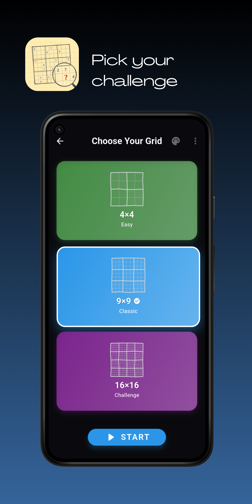
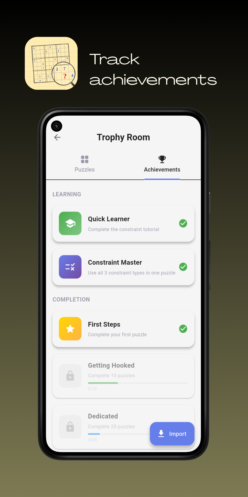
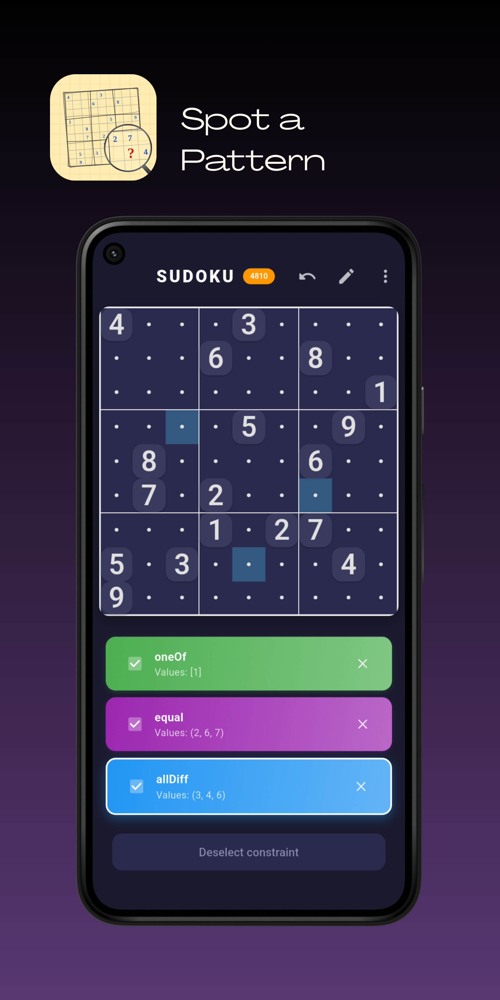
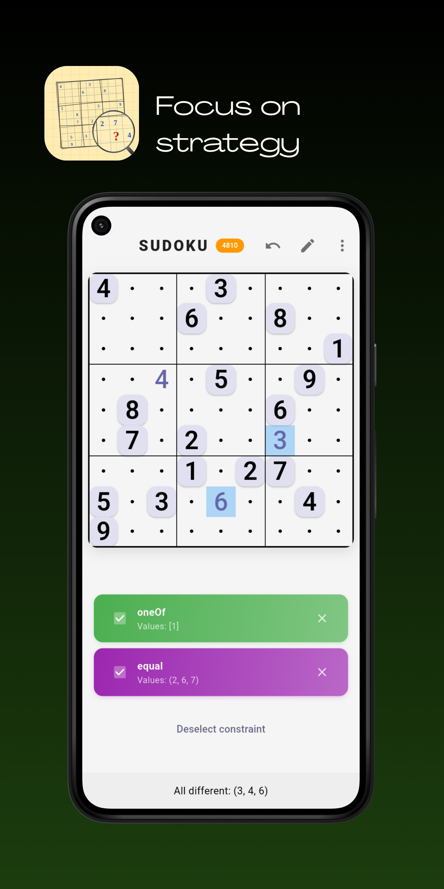

<p align="center">
  
</p>

<p align="center">
  <a href="https://github.com/theoden8/sudaku/actions/workflows/build.yml">
    
  </a>
  <a href="https://f-droid.org/packages/com.gitea.theoden8.sudaku/">
    
  </a>
</p>

<p align="center">
  <a href="https://f-droid.org/packages/com.gitea.theoden8.sudaku/">
    
  </a>
  <a href="https://apps.apple.com/app/sudaku/id6758774395">
    
  </a>
</p>

## About

Find a pattern, let your logic ripple across the grid, and focus on your next insight. Sudaku is your tireless sudoku workhorse - it handles all the grunt work while you do the thinking. Spot something? It fills in every obvious consequence. Express patterns using constraints like `alldifferent`, `one-of`, and value elimination. Your rules, your strategy, your glory. 9×9 and 16×16 puzzles included.

## Screenshots

<p align="center">
  
  
  
  
</p>

## Technology

Built with [Flutter](https://flutter.dev/) for cross-platform support on Android, iOS, Linux, macOS, and Windows. Uses [sdsolve](https://github.com/theoden8/sdsolve) for constraint solver implementation.

## Building

* **Android** (apk)

```bash
fvm flutter build apk --release --split-per-api
```

* **MacOS** (app)

```bash
fvm flutter create --platforms=windows,macos,linux .
fvm flutter build macos --release
# find . -name "*.app"
```

* **Linux** (appimage)

```bash
# requires appimagetool, appimage-builder
fvm flutter create --platforms=windows,macos,linux .
fvm flutter build linux --release
appimage-builder --skip-test
```

## Contributing

Contributions are welcome! Feel free to open issues for bugs or feature requests, or submit pull requests. Please note that this project is in early development.

## References

* http://magictour.free.fr/topn87 - hardest 87 9x9 puzzles
* http://magictour.free.fr/top1465 - hardest 1465 9x9 puzzles
* http://magictour.free.fr/top44 - hardest 44 16x16 puzzles
* http://pi.math.cornell.edu/~mec/Summer2009/Mahmood/Symmetry.html
* https://www.csplib.org/Problems/ - list of constraint satisfaction problems

## Support

[](https://getmonero.org) [XMR: 86tFFhT6hdUQAzcc2Za7i8ZggwQusf1ssgUNby2ApEvJDBodye8CQdJgXLaNMnun5YHm8im8MhnoK91XPWb99YdvDnfiYGZ](monero:86tFFhT6hdUQAzcc2Za7i8ZggwQusf1ssgUNby2ApEvJDBodye8CQdJgXLaNMnun5YHm8im8MhnoK91XPWb99YdvDnfiYGZ)
